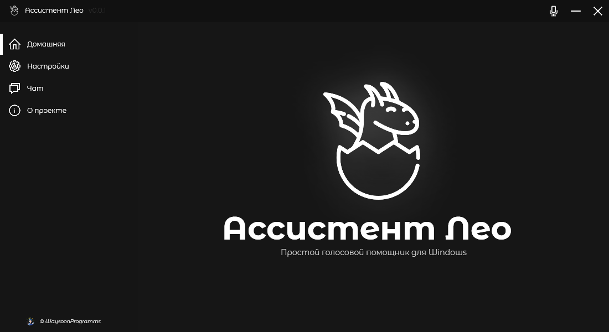

  <picture>
    <source media="(prefers-color-scheme: dark)" srcset="./Assets/Repo/banner.png">
    
  </picture>

  

    
    
    
  

<h1> Описание </h1>

Джайна — голосовой помощник для Windows, разработанный на языке C#. Он надежно распознает голос благодаря использованию Vosk API. Первоначально проект был задуман для изучения программирования на C#, но вскоре стало ясно, что у него есть огромный потенциал стать моим первым крупным проектом.

<h1> Технологии </h1>

Произнесено голосом Eugene с использованием <a href="https://github.com/snakers4/silero-models">Silero TTS</a>. Распознавание осуществлено через <a href="https://github.com/alphacep/vosk-api">Vosk API</a>.

<h1> Скриншот приложения </h1>
<picture>
    
</picture>

<h1> Голосовые Команды </h1>

Для активации ассистента следует произнести его имя (<i>Джайна</i>). Это можно сделать как вместе с запросом, так и отдельно, без разницы.

<h2> Что он может: </h2>
<h3> Запускать приложения: </h3>
<ul>
    <li><code>Открой Телеграм</code> - Запускает Telegram Desktop.</li>
    <li><code>Открой консоль</code> - Запускает CMD</li>
</ul>
<h3> Открывать сайты: </h3>
<ul>
    <li><code>Открой ВКонтакте</code> - Открывает ВК</li>
    <li><code>Открой почту</code> - Открывает Gmail</li>
    <li><code>Открой YouTube</code> - Открывает YouTube</li>
</ul>
<h3> Помогать управлять компьютером: </h3>
<ul>
    <li><code>Почисти корину</code> - Очищает корзину</li>
    <li><code>Поставь на паузу</code> - Ставит на паузу музыку</li>
    <li><code>Включи обратно</code> - Снимает с паузы музыку</li>
    <li><code>Следующий/Предыдущий трек</code> - Управляет очередью</li>
    <li><code>Закрой</code> - Закрывает окно в фокусе</li>
</ul>

<h1> Коды ошибок </h1>
<ul>
<li><code>6066</code> - Джайне не удалось получить доступ к микрофону. Попробуйте разрешить приложению доступ к микрофону: Параметры Windows -> Конфиденциальность -> Разрешения -> Микрофон</li>
<li><code>1423</code> - Не удалось создать запись в реестре</li>
<li><code>4044</code> - Не удалось изменить/удалить запись в реестре</li>
<li><code>8088</code> - Не удалось загрузить последние сообщения из чата</li>
<li><code>9099</code> - Количество сообщений достигло 10 000. Это может замедлить работу приложения. Так же, большое количество сообщений</li>
</ul>

<h1> Связаться со мной </h1>
<ul>
  <li> Discord: https://discord.gg/p5uB5Y2DEJ </li>
  <li> VK: https://vk.com/articsdev </li>
</ul>
